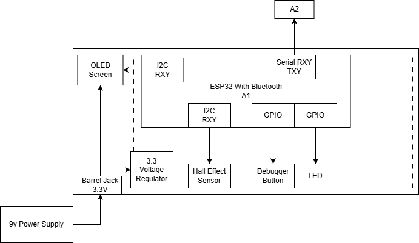

## Overview
This block diagram is for the display and control ESP32 for the rover. This subsystem will use serial cvode to send information to the rover that the rover will then articulate to move and travel or do specific actions. Since this piece is not connected to the roiver, it will need a seperate power system with voltage regulators. THis will also need the OLED screen that will display serial information to the user. 

## A2 Block Diagram 

