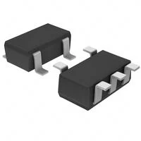
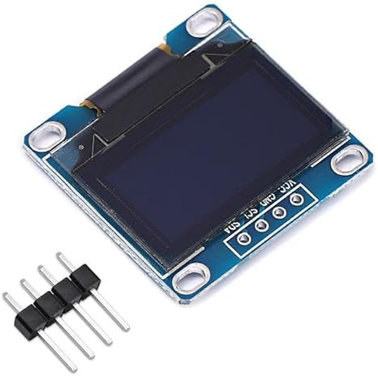

## Module's Selected Major Components

The following sections are the selected major components necessary for  A1 of the wireless communication system. This subsystem focuses on the OLED screen and communicating to the other subsystems to map out the picture. 

### Power Management

**Chosen Regulator**

1. LM2575D2T-3.3R4G

    

This will hit the voltage minimum and is inexpensive. It has little pins and is a similat schematic to one that we have used before. 

For more details, review the ["Appendix - Component Selection Process - Power Management"](https://isrysm52.github.io/EGR314_isrysm52.github.io/Appendix/01-Componet-Selection/Component-Selection-Process/) selection.

### OLED

**Chosen OLED**

1. 0.96-inch 12864 128X64 OLED LCD Display Board Module

    

This is because it is already in class. This makes it easier to aquire and something that we have worked with before. This is also inexpensive and simple to program. 

For more details, review the ["Appendix - Component Selection Process - OLED"](https://isrysm52.github.io/EGR314_isrysm52.github.io/Appendix/01-Componet-Selection/Component-Selection-Process/) selection.

