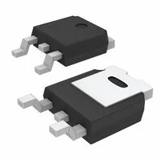

## Module's Selected Major Components

The following sections are the selected major components necessary for  A1 of the wireless communication system. This subsystem focuses on the OLED screen and communicating to the other subsystems to map out the picture. 

### Power Management

**3.3V regulator 1**

1. LD1117DT33CTR

    

    * $0.40/each
    * [link to product](https://www.digikey.com/en/products/detail/stmicroelectronics/LD1117DT33CTR/586235?gclsrc=aw.ds&gad_source=1&gad_campaignid=20509815359&gbraid=0AAAAADrbLliyZmx9BK5L6rwPuDaWW5-2g&gclid=Cj0KCQiA7rDMBhCjARIsAGDBuEAoAiDGUQvUyvDstxs-5wdHbAnu0Tvwgpu9TgnrcwJ67x63XssjFMQaAlonEALw_wcB)

    | Pros                                      | Cons                                                             |
    | ----------------------------------------- | ---------------------------------------------------------------- |
    | Inexpensive                               | Small |
    | Compatible ESP32                      |            few pins                            |
    | Meets surface mount constraint of project |           in stock                       |

**Rationale:** Only a few pins make it easier to mount. 

**3.3V regulator 2**

1. TLV1117-33CDCY

    

    * $0.91/each
    * [link to product](https://www.digikey.com/en/products/detail/texas-instruments/TLV1117-33CDCY/1677125?gclsrc=aw.ds&gad_source=1&gad_campaignid=21273973101&gbraid=0AAAAADrbLlj0ovzDO_yai2NTRSSh8NprL&gclid=Cj0KCQiA7rDMBhCjARIsAGDBuEAC3SixX94Gzbsoar3GId_8D0Os2vkl1xHp72Jrp2GsBw_p_PErV4waAh2zEALw_wcB)

    | Pros                                      | Cons                                                             |
    | ----------------------------------------- | ---------------------------------------------------------------- |
    | Inexpensive                               | Small |
    |     Can handle high voltage                 |                Long wait time                         |
    | Meets surface mount constraint of project |

**Rationale:**A bit more expensive, with not a lot of pros past the first one. 

**3.3V regulator 3**

1. BU33TD3WG-TR

    

    * $0.38/each
    * [link to product](https://www.digikey.com/en/products/detail/rohm-semiconductor/BU33TD3WG-TR/2409428?gclsrc=aw.ds&gad_source=1&gad_campaignid=20747733577&gbraid=0AAAAADrbLljFQbif_uigdV9GANgIVP3xN&gclid=Cj0KCQiA7rDMBhCjARIsAGDBuEDKyQxQp39KxQtFf5nAJ_CS4XkOX_Z056Hu7cVJlJR5UZOKf4LyQKwaAh0HEALw_wcB)

    | Pros                                      | Cons                                                             |
    | ----------------------------------------- | ---------------------------------------------------------------- |
    | Inexpensive                               | 9 week manufature time |
    | Can get multiple at a time                    | only up to 6V                         |
    | Meets surface mount constraint of project |

**Rationale:** Will not hit the 9V minimum

(**remove this note/placeholder**: this is where your 3.3 volt switching regulator, any other needed power regulator, and power source {if applicable} **THAT WERE SELECTED**)

For more details, review the ["Appendix - Component Selection Process - Power Management"](https://embedded-systems-design.github.io/EGR314DataSheetTemplate/Appendix/01-Componet-Selection/Component-Selection-Process/#power-management) selection.

### OLED Screen

**OLED 1**

1. AS5600-ASOM SOIC8 LF T&RDP

    

    * $3.17/each
    * [link to product](https://www.digikey.com/en/products/detail/ams-osram/AS5600-ASOM/4914332)

    | Pros                                      | Cons                                                             |
    | ----------------------------------------- | ---------------------------------------------------------------- |
    | Inexpensive                               | Small |
    | Compatible ESP32                      | Needs special PCB layout.                                        |
    | Meets surface mount constraint of project | Has had problems with programming the sensor  |

**Rationale:** We have used this product before. 

**OLED 2**

1. XC1259TR-ND surface mount crystal

    

    * $1/each
    * [link to product](http://www.digikey.com/product-detail/en/ECS-40.3-S-5PX-TR/XC1259TR-ND/827366)

    | Pros                                      | Cons                                                             |
    | ----------------------------------------- | ---------------------------------------------------------------- |
    | Inexpensive                               | Requires external components and support circuitry for interface |
    | Compatible with PSoC                      | Needs special PCB layout.                                        |
    | Meets surface mount constraint of project |

**Rationale:** A clock oscillator is easier ...

**OLED 3**

1. XC1259TR-ND surface mount crystal

    

    * $---/each
    * [link to product](https://www.amazon.com/Songhe-0-96-inch-I2C-Raspberry/dp/B085WCRS7C/)

    | Pros                                      | Cons                                                             |
    | ----------------------------------------- | ---------------------------------------------------------------- |
    | Already have in class                               | From Amazon |
    | Smaller screen                     | Currently unavailable                                   |
    | Meets surface mount constraint of project |

**Rationale:** It might be easier to program with a smaller screen, but there is less room for error. 

(**remove this note/placeholder**: if applicable, this is where your  **SELECTED** sensor is shown. Otherwise, remove this section.)

