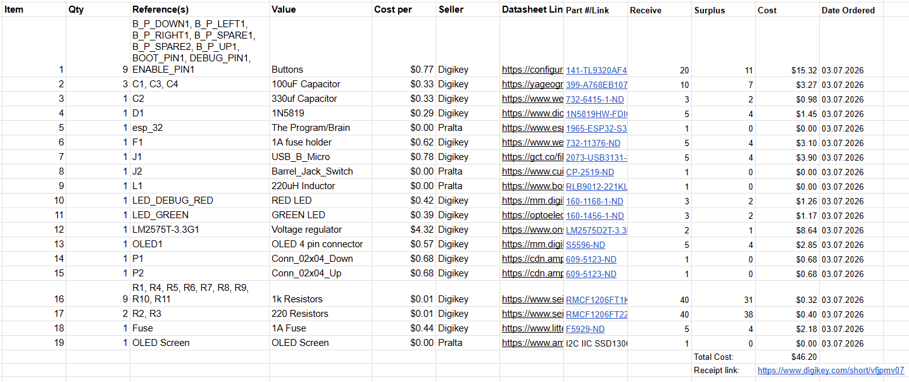

## Overview
This is the bill of materials for the A1 subsystem. There are many buttons and extra pieces just in case the PCB becomes broken and we need to build another one. Most pieces were found on Digikey while the rest were obtained in class. 

## Bill of Materials
{style width: "2000"}
**Figure ##:** Example Bill of Materials as a screenshot.

## Resouce

The Bill of Material as a PDF download is available [*here*](BOM_A1_Sub - Sheet1.pdf).
