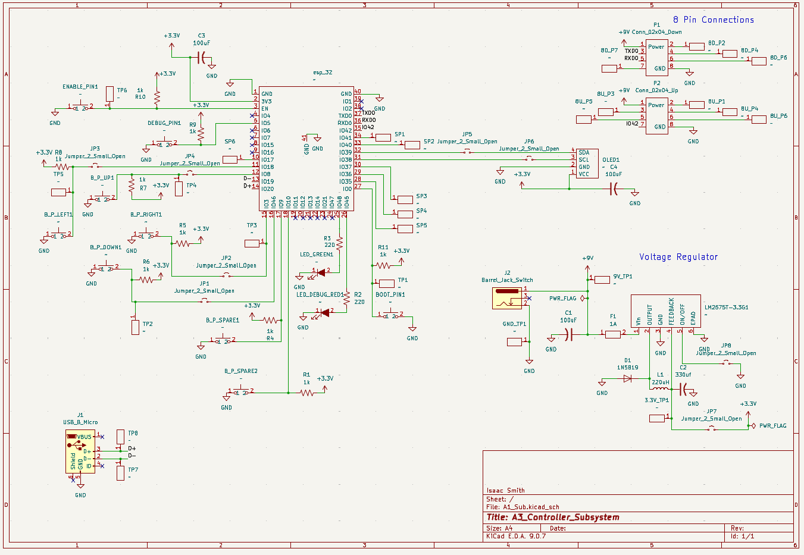

## Overview

This schematic is designed to show data of the rover by receiving information from subsystem A2. 

{style width:"350" height:"300;"}
**Figure ##:** Showing the schematic.

## Resouces

The schematic as a PDF download is available [*here*](A1_Sub.pdf), and the Zip folder of the project [*here*](A1_Controller_Subsystem.zip).
