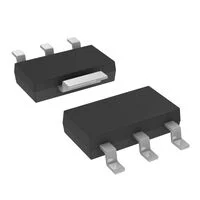
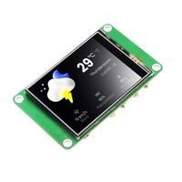
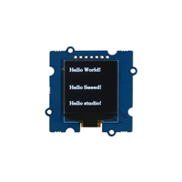

## Module's Major Components Selection Process

### Power Management

**3.3V regulator 1**

1. LD1117DT33CTR

    

    * $0.40/each
    * [link to product](https://www.digikey.com/en/products/detail/stmicroelectronics/LD1117DT33CTR/586235?gclsrc=aw.ds&gad_source=1&gad_campaignid=20509815359&gbraid=0AAAAADrbLliyZmx9BK5L6rwPuDaWW5-2g&gclid=Cj0KCQiA7rDMBhCjARIsAGDBuEAoAiDGUQvUyvDstxs-5wdHbAnu0Tvwgpu9TgnrcwJ67x63XssjFMQaAlonEALw_wcB)

    | Pros                                      | Cons                                                             |
    | ----------------------------------------- | ---------------------------------------------------------------- |
    | Inexpensive                               | Small |
    | Compatible ESP32                      |            few pins                            |
    | Meets surface mount constraint of project |           in stock                       |

**Rationale:** Only a few pins make it easier to mount. 

**3.3V regulator 2**

1. TLV1117-33CDCY

    

    * $0.91/each
    * [link to product](https://www.digikey.com/en/products/detail/texas-instruments/TLV1117-33CDCY/1677125?gclsrc=aw.ds&gad_source=1&gad_campaignid=21273973101&gbraid=0AAAAADrbLlj0ovzDO_yai2NTRSSh8NprL&gclid=Cj0KCQiA7rDMBhCjARIsAGDBuEAC3SixX94Gzbsoar3GId_8D0Os2vkl1xHp72Jrp2GsBw_p_PErV4waAh2zEALw_wcB)

    | Pros                                      | Cons                                                             |
    | ----------------------------------------- | ---------------------------------------------------------------- |
    | Inexpensive                               | Small |
    |     Can handle high voltage                 |                Long wait time                         |
    | Meets surface mount constraint of project |

**Rationale:**A bit more expensive, with not a lot of pros past the first one. 

**3.3V regulator 3**

1. LM2575D2T-3.3R4G

    

    * $2.16/each
    * [link to product](https://www.digikey.com/en/products/detail/onsemi/LM2575D2T-3-3R4G/1476688)

    | Pros                                      | Cons                                                             |
    | ----------------------------------------- | ---------------------------------------------------------------- |
    | Inexpensive                               | 9 week manufacturing time |
    | Can get multiple at a time                    | only up to 6V                         |
    | Meets surface mount constraint of project |

**Rationale:** Will not hit the 9V minimum

**Chosen Regulator**

1. LM2575D2T-3.3R4G

    

This will hit the voltage minimum and is inexpensive. It has little pins and is a similat schematic to one that we have used before. 

### OLED Screen

**OLED 1**

1. CROWPANEL PICO DISPLAY-2.4 INCH

    

    * $36.38/each
    * [link to product](https://www.digikey.com/en/products/detail/elecrow/DIS09024P/24398500?gclsrc=aw.ds&gad_source=1&gad_campaignid=20698867905&gbraid=0AAAAADrbLli8qZJdbmq7cFWXmJIymIBvG&gclid=Cj0KCQiA7rDMBhCjARIsAGDBuEA0tXL8ygxC33pYuuSTrbPVZrzGoA0FfyIRg_Q4sjxmkOSqDfjuGVgaAkH1EALw_wcB)

    | Pros                                      | Cons                                                             |
    | ----------------------------------------- | ---------------------------------------------------------------- |
    | Clean screen                               | Expansive |
    | Compatible ESP32                      | More programming                                        |
    | Meets surface mount constraint of project |  |

**Rationale:** More expensive, but it is a higher-quality screen that can potentially do more.

**OLED 2**

1. GROVE OLED DISPLAY 1.12" SH1107

    

    * $12.50/each
    * [link to product](https://www.digikey.com/en/products/detail/seeed-technology-co-ltd/104020250/14672112?gclsrc=aw.ds&gad_source=1&gad_campaignid=20243136172&gbraid=0AAAAADrbLljIa7RHYodMuhWdMERyMUzd9&gclid=Cj0KCQiA7rDMBhCjARIsAGDBuEArhelXRab3ZXCNusx00oJfkGO6C5ADzqw2HOVdzB3-KjX8GFxT4aUaAhlbEALw_wcB)

    | Pros                                      | Cons                                                             |
    | ----------------------------------------- | ---------------------------------------------------------------- |
    | Inexpensive                               | May not work well with ESP32 |
    | Bigger screen                   | Only 63 in stock and long manufacturing wait time                   |
    | Meets surface mount constraint of project |

**Rationale:** A lot cheaper, but can be hard to get.

**OLED 3**

1. 0.96-inch 12864 128X64 OLED LCD Display Board Module

    

    * $---/each
    * [link to product](https://www.amazon.com/Songhe-0-96-inch-I2C-Raspberry/dp/B085WCRS7C/)

    | Pros                                      | Cons                                                             |
    | ----------------------------------------- | ---------------------------------------------------------------- |
    | Already have in class                               | From Amazon |
    | Smaller screen                     | Currently unavailable                                   |
    | Meets surface mount constraint of project | Uses I2C  |

**Rationale:** It might be easier to program with a smaller screen, but there is less room for error. 

**Chosen OLED**

1. 0.96-inch 12864 128X64 OLED LCD Display Board Module

    

This is because it is already in class. This makes it easier to aquire and something that we have worked with before. 