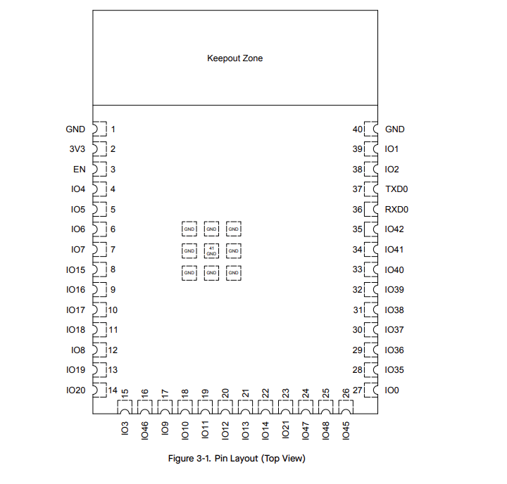

| ESP Info                                      | Answer | Help                                                                                                      |
| --------------------------------------------- | ------ | --------------------------------------------------------------------------------------------------------- |
| Model                                         | ESP32-S3-WROOM-1-N4     | Include the entire part number (leave off any letters at the end that specify the package type)           |
| Product Page URL                              |  [Link](https://www.digikey.com/en/products/detail/espressif-systems/ESP32-S3-WROOM-1-N4/16162639)     | Found on digikey.com     |
| ESP32-S3-WROOM-1-N4 Datasheet URL             | [Link](https://documentation.espressif.com/esp32-s3-wroom-1_wroom-1u_datasheet_en.pdf)      | Do not paste links directly into the table.  Use a [link](#)    |
| ESP32 S3 Datasheet URL                        | [Link](https://www.digikey.com/en/product-highlight/s/schtoeta/esp32-wroom-32-wi-fi-bluetooth-module)      | Has more detail on functions   |
| ESP32 S3 Technical Reference Manual URL       | ?      | Has details on I/O multiplexing, USB, and others                                                          |
| Vendor link                                   | [Link](https://www.digikey.com/en/products/detail/espressif-systems/ESP32-S3-WROOM-1-N4/16162639)        | Digikey, Jameco, etc.                 |
| Code Examples                                 | ?      | url(s) for libraries on github or other sites related to the microcontroller and your planned peripherals |
| External Resources URL(s)                     | ?      | Search on Google and YouTube for other resources for each specific microcontroller.                       |
| Unit cost                                     | 5.06      | Find on Digikey, Jameco, MPJA, or octopart                                                                |
| Absolute Maximum Current for entire IC        | 97mA      | Find in the microcontroller datasheet                                                                     |
| Supply Voltage Range                          | 3V-3.6V      | Min / Nominal / Max / Absolute Max, as found in datasheet                                                 |
| Maximum GPIO current   (per pin)           | 355mA      | as found in datasheet                                                                                     |
| Supports External Interrupts?                 | Yes      | as found in datasheet                                                                                     |
| Required Programming Hardware, Cost, URL      | Yes      | as found in datasheet                                                                                     |

| Module         | # Available | Needed | Associated Pins (or * for any) |
| -------------- | ----------- | ------ | ------------------------------ |
| UART           | 0           | 0      | ?                              |
| external SPI\* | 10           | 2      | ?                              |
| I2C            | 0           | 0      | ?                              |
| GPIO           | 28           | 2      | ?                              |
| ADC            | 20           | 0      | ?                              |
| LED PWM        | 2           | 0      | ?                              |
| Motor PWM      | 2           | 0      | ?                              |
| USB Programmer | 1           | 1      | ?                              |
| ...            |

\* The ESP32-S2 has multiple SPI interfaces, but some are for internal use
