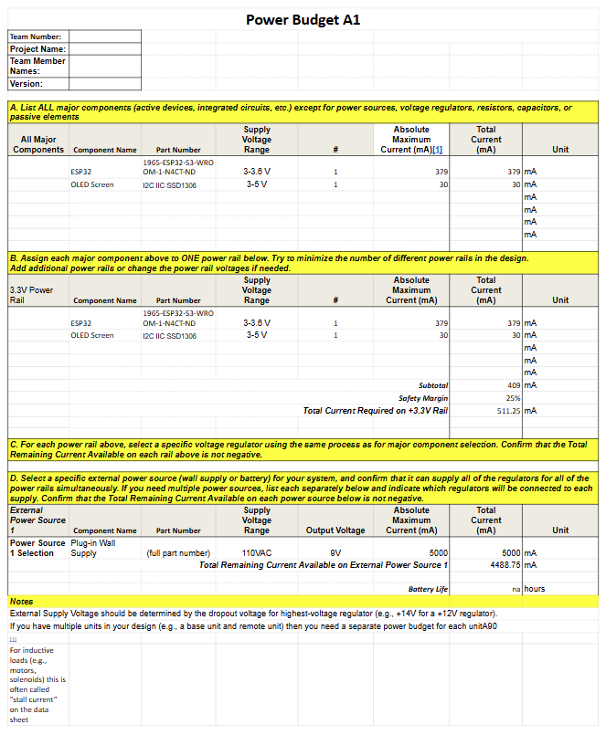

## Overview
This power budget was created to make sure that the wall power supply could supply the esp32. This is for a greander scheme of a whole system even though this subsystem does not use a whole lot of current. 

{style width:"350" height:"300;"}

## Conclusions

From the prepare Power Budget, this subsystem has plenty of power from a 9V power supply. The only two main components are the esp32 and the OLED screen which means they come out to a little more than 500mA. This also means that the excess power can go to the next subsystem nearby which is the wir3eless system. The two subsystemsa are the only subsystems with this power since they are the remote control. 

## Resouces

The power budget as a PDF download is available [*here*](Power Budget A1 - Sheet1.pdf), and a Microsoft Excel Sheet [*here*](Power Budget A1.xlsx).